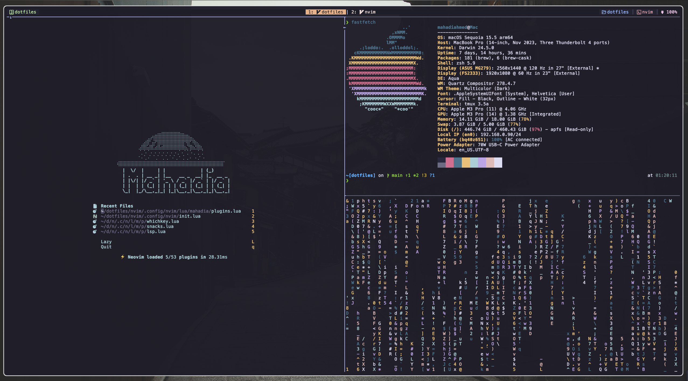

# Mahadi's dotfiles




The setup script will install homebrew, dependencies & setup:
* nvim
* aerospace
* bat
* p10k
* tmux
* zshrc

Run the setup script:
```
source setup.sh
```

To try out the dotfiles in a container:
```
docker build -f DockerImages/Dockerfile-simple -t 'dotfiles:test' . && \
docker run -d --name dotfilesTest -it dotfiles:test && \
docker exec -it dotfilesTest /bin/zsh
```

---
# Resources & Inspo
* [Bootstrap repositories](https://dotfiles.github.io/bootstrap/)
* [omerxx dotfiles](https://github.com/omerxx/dotfiles)
* [joshmedeski dotfiles](https://github.com/joshmedeski/dotfiles)
* [Your unofficial guide to dotfiles on GitHub](https://dotfiles.github.io)
* [Sync your .dotfiles with git and GNU #Stow like a pro!](https://www.youtube.com/watch?v=CFzEuBGPPPg)
