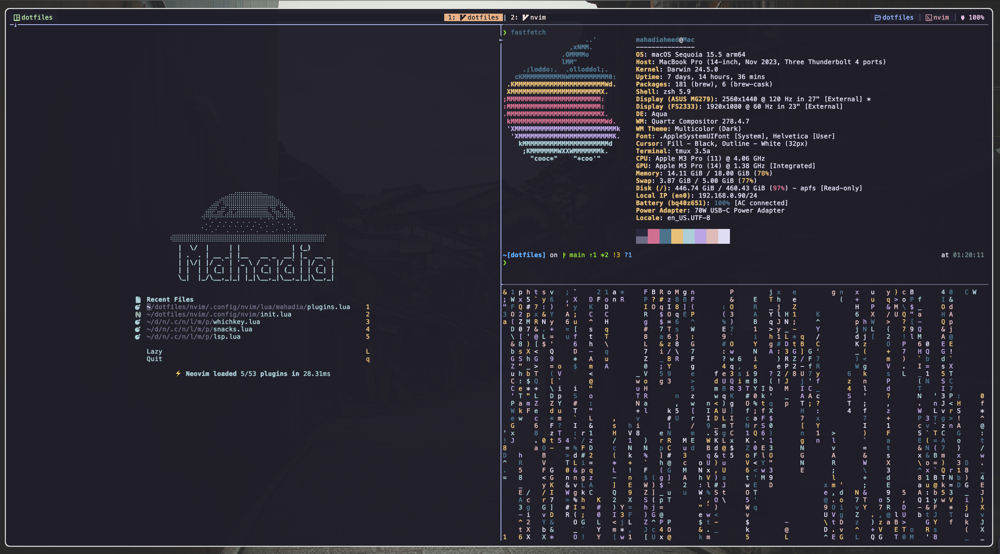

# Mahadi's dotfiles

# TODO:
[ ] Tmux topbar should have repo name as a prefix




The setup script will install homebrew, dependencies & setup:
* nvim
* aerospace
* bat
* starship
* kitty
* tmux
* zshrc
* atuin

Run the setup script:
```
source setup.sh
```

<!-- To try out the dotfiles in a container: -->
<!-- - Clone the repository -->
<!-- - Run the commands in the root of the repository: -->
<!---->
<!-- ``` -->
<!-- docker build -f DockerImages/Dockerfile-simple -t 'dotfiles:test' . && \ -->
<!-- docker run -d --name dotfilesTest -it dotfiles:test && \ -->
<!-- docker exec -it dotfilesTest /bin/zsh -->
<!-- ``` -->

## Pi Setup

SSH into the Pi, clone the repo, and run:
```
git clone https://github.com/Mahadi-Ahmed/dotfiles.git ~/dotfiles
cd ~/dotfiles
source setup-pi.sh
```

After setup, log out and back in (for zsh), then:
- Open `nvim` and run `:Lazy sync`
- Open `tmux` and press `prefix + I` to install plugins

---
# Resources & Inspo
* [Bootstrap repositories](https://dotfiles.github.io/bootstrap/)
* [omerxx dotfiles](https://github.com/omerxx/dotfiles)
* [joshmedeski dotfiles](https://github.com/joshmedeski/dotfiles)
* [Your unofficial guide to dotfiles on GitHub](https://dotfiles.github.io)
* [Sync your .dotfiles with git and GNU #Stow like a pro!](https://www.youtube.com/watch?v=CFzEuBGPPPg)
* [osx setup script](https://github.com/mathiasbynens/dotfiles/blob/main/.macos)
* [dreams of code](https://gist.github.com/elliottminns)
